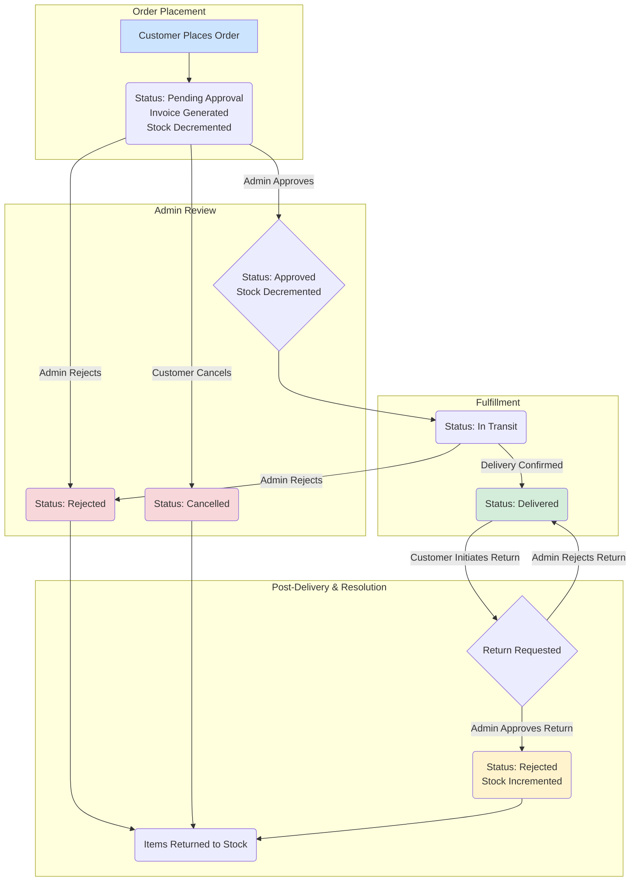

# Orders System

### Order Statuses

| Awaiting Approval | In Transit | Delivered | Cancelled | Rejected |
| :---------------- | :--------- | :-------- | :-------- | :------- |

---

### Order Management Lifecycle

---

_Last updated on June 24, 2025 by Ayman._
