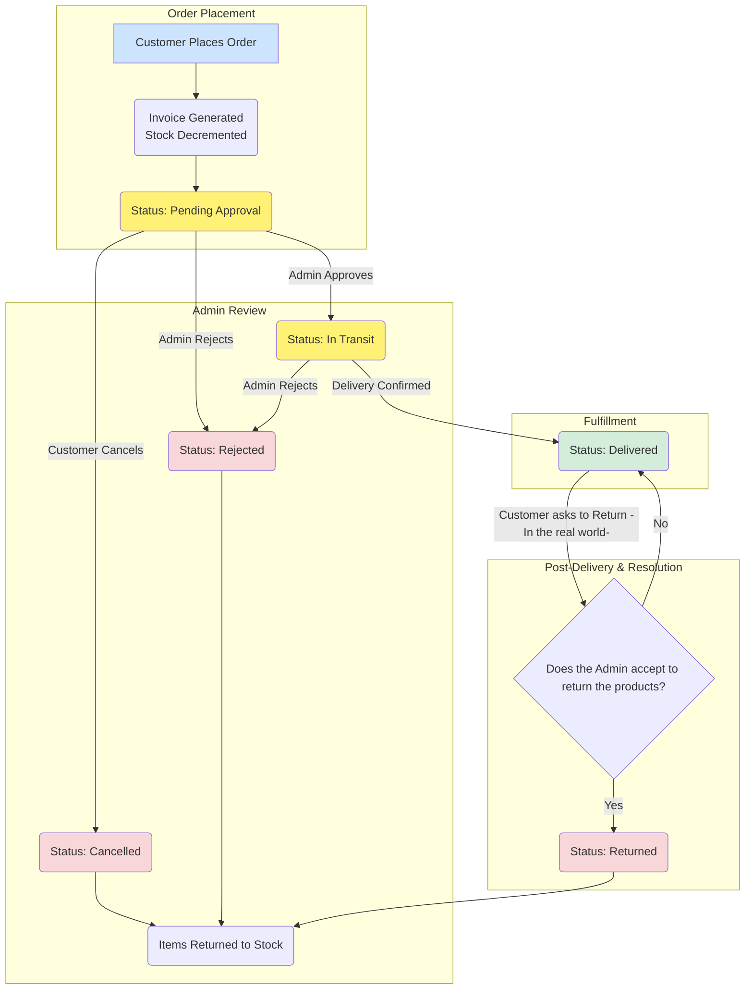

# Orders System

### Order Statuses

| Awaiting Approval | In Transit | Delivered | Cancelled | Rejected | Returned |
| :---------------- | :--------- | :-------- | :-------- | :------- | :------- |

---

### Order Management Lifecycle

:::note
Only the financial report will change if you delete a `Delivered` Order log, but the item's quantity & selling counter won't change, you must reject the order to change the items' quantites & sold items counter.
:::

---

_Last updated on June 29, 2025 by Ayman._
